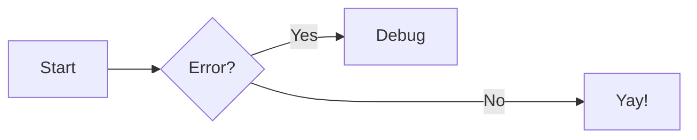

# Zensical Markdown 記法カタログ

公式ドキュメント（https://zensical.org/docs/authoring/）の全記法をまとめたもの。各記法の「必要な拡張」は `zensical new` の既定設定に含まれるものを（既定）と表記する。含まれないものは `zensical-config` skill を見て設定に追加する。

## Frontmatter

```yaml
---
title: ナビと title タグを上書き
description: HTML head の meta description
icon: lucide/braces          # ナビに表示するアイコン
status: new                  # ナビにステータス表示。組み込みは new / deprecated
tags:                        # ページ下部に表示、検索でフィルタ可能
  - HTML5
template: my_homepage.html   # カスタムテンプレート（overrides に配置）
hide:                        # ページ要素の非表示
  - navigation               # 左サイドバー
  - toc                      # 右の目次
  - tags
search:
  exclude: true              # 検索インデックスから除外
---
```

セクション単位の検索除外は見出しに `{ data-search-exclude }` を付ける。

独自ステータスは `[project.extra.status]` に `identifier = "説明"` を定義して使う。

## Admonitions（必要: admonition（既定）、折りたたみは pymdownx.details（既定））

```markdown
!!! note "カスタムタイトル"

    本文は4スペースインデント。

!!! note ""        <!-- タイトルなし -->
??? note           <!-- 折りたたみ（閉） -->
???+ note          <!-- 折りたたみ（開） -->
!!! info inline end "サイドバー風"   <!-- 右寄せ。対象コンテンツより前に書く -->
```

型（12種）: `note`（既定）, `abstract`, `info`, `tip`, `success`, `question`, `warning`, `failure`, `danger`, `bug`, `example`, `quote`。

ネスト可（内側をさらに4スペース）。アイコン変更は `[project.theme.icon.admonition]` で `note = "octicons/tag-16"` のように指定。

## コードブロック（必要: pymdownx.highlight / superfences / inlinehilite（既定）、外部ファイル埋め込みは pymdownx.snippets（既定外））

````markdown
``` py title="bubble_sort.py" linenums="1" hl_lines="2 3"
...
```
````

- `title="..."`: ファイル名などの見出し
- `linenums="1"`: 行番号（開始行指定可）
- `hl_lines="2 3"` / `hl_lines="3-5"`: 行ハイライト（linenums の開始値に関係なく1起点）
- インラインハイライト: `` `#!python range()` ``（shebang 記法）
- 外部ファイル埋め込み: ブロック内に `--8<-- "path/to/file"`（snippets 必要。パスは zensical.toml のあるディレクトリ起点。動作確認済み）
- ブロック単位のボタン制御: ` ``` { .yaml .copy } ` / `.no-copy` / `.select` / `.annotate`

### コードアノテーション（必要: features に content.code.annotate）

````markdown
``` toml
features = ["content.code.annotate"] # (1)!
```

1.  アノテーション本文。Markdown 何でも可。
````

- コメント構文の中にのみ置ける（Pygments 必須。コメントのない言語は不可）
- `# (1)!` の `!` はコメント記号ごと除去する指定
- 文字列内などに置くには `[project.extra.annotate]` で言語ごとに Pygments レキシム（例 `json = [".s2"]`）を追加

## コンテンツタブ（必要: pymdownx.tabbed + superfences（既定））

```markdown
=== "タブ1"

    中身は4スペースインデント。コードブロック・リスト・さらにタブもネスト可。

=== "タブ2"

    ...
```

- admonition 内にもネスト可
- サイト全体でタブ選択を連動: features に `content.tabs.link`（同一ラベルで連動）
- アンカーを綺麗にする: `[project.markdown_extensions.pymdownx.tabbed.slugify]` に `object = "pymdownx.slugs.slugify"`, `kwds = { case = "lower" }`

## 図（Mermaid）（必要: superfences の custom_fences（既定））

````markdown

````

公式サポート: flowchart（`graph`）、`sequenceDiagram`、`stateDiagram-v2`、`classDiagram`、`erDiagram`。この5種はテーマのフォント・配色に自動追従し、ライト/ダーク両対応。pie/gantt 等も動くが非推奨（モバイルで崩れる）。

## 画像（必要: attr_list / md_in_html（既定）、キャプションは pymdownx.blocks.caption（既定外））

```markdown
{ align=left }          # align=left / align=right（center はない）
{ width="300" }
{ loading=lazy }
             # ライトモード専用
               # ダークモード専用

{ width="300" }
/// caption
キャプション文
///
```

ライトボックス（クリックで拡大）は `[project.markdown_extensions.zensical.extensions.glightbox]` を有効化。

## グリッド（必要: attr_list / md_in_html（既定））

```html
<!-- カードグリッド（リスト構文） -->
<div class="grid cards" markdown>

-   :material-clock-fast:{ .lg .middle } __見出し__

    ---

    説明文

    [:octicons-arrow-right-24: リンク](page.md)

-   :material-format-font:{ .lg .middle } __見出し2__

    ---

    説明文

</div>

<!-- 汎用グリッド: div class="grid" で任意ブロック（admonition・タブ等）を並べる -->
```

インデックスページの概要カードに最適。`markdown` 属性を div に必ず付ける。

## リスト（必要: def_list / pymdownx.tasklist（既定））

```markdown
- 順不同リスト（ネストは4スペース）

1.  順序付き（すべて 1. でも自動採番）

`用語`
:   定義リスト。定義は4スペースインデント。

- [x] タスク完了
- [ ] タスク未完了
```

## データテーブル（既定で動作。明示するなら `[project.markdown_extensions.tables]`）

```markdown
| Method   | Description    |
| :------- | -------------: |
| `GET`    | Fetch resource |
```

`:` の位置で左寄せ/中央/右寄せ。セル内に inline code・アイコン・絵文字可。ソート可能にするには tablesort を extra_javascript で追加。

## 脚注（必要: footnotes（既定））

```markdown
本文[^1]。

[^1]: 1行の脚注。
[^2]:
    複数行の脚注は次行から4スペースインデント。
```

ツールチップ表示: features に `content.footnote.tooltips`。

## テキスト装飾（必要: pymdownx.caret / mark / tilde / keys（既定））

```markdown
==マーク（ハイライト）==   ^^挿入（下線）^^   ~~削除（取り消し線）~~
H~2~O（下付き）   A^T^A（上付き）
++ctrl+alt+del++（キーボードキー）
```

## 数式（必要: pymdownx.arithmatex generic=true（既定）+ extra_javascript）

```latex
$$
E = mc^2          <!-- ブロック: $$...$$ を独立行で -->
$$

インライン: $f(x)$ または \(f(x)\)
```

MathJax か KaTeX のどちらかを extra_javascript で読み込む必要がある。設定スニペットは https://zensical.org/docs/authoring/math/ を参照（instant navigation 対応の `document$.subscribe` を含む）。速度重視なら KaTeX、LaTeX 機能の広さ・アクセシビリティなら MathJax。

## アイコン・絵文字（必要: pymdownx.emoji + attr_list（既定））

```markdown
:smile:                              # 絵文字（Twemoji ショートコード）
:fontawesome-brands-github:          # アイコン（パスの / を - に置換）
:material-information-outline:{ title="ツールチップ" }
:fontawesome-brands-youtube:{ .youtube }   # CSS クラスで色・アニメーション
```

同梱アイコンセット: `lucide/*`, `material/*`, `fontawesome/*`, `octicons/*`, `simple/*`（計10,000種以上）。

## ボタン（必要: attr_list（既定））

```markdown
[テキスト](page.md){ .md-button }
[テキスト](page.md){ .md-button .md-button--primary }
[Send :fontawesome-solid-paper-plane:](page.md){ .md-button }
```

## ツールチップ・略語・用語集（必要: abbr / attr_list（既定）、用語集は pymdownx.snippets（既定外））

```markdown
[Hover me](https://example.com "ツールチップ文")

The HTML specification is maintained by the W3C.

*[HTML]: Hyper Text Markup Language
*[W3C]: World Wide Web Consortium
```

- 表示を改良ツールチップにする: features に `content.tooltips`
- サイト共通用語集: 略語定義を `includes/abbreviations.md`（docs_dir の外）に置き、`[project.markdown_extensions.pymdownx.snippets]` に `auto_append = ["includes/abbreviations.md"]`

## リンク

- ページ間は Markdown ファイルへの相対リンク: `[基本設定](../setup/basics.md)`、アンカー付きは `(../setup/basics.md#site_url)`
- 絶対 URL・生成後 HTML パスへの内部リンクは書かない（site_url 変更や出力形式変更で壊れる）
- 参照リンク形式も可: `[text][ref]` + `[ref]: url "tooltip"`

## ページタイトルの優先順位

1. `nav` 設定でのタイトル → 2. frontmatter の `title` → 3. ページ先頭の h1 → 4. ファイル名

注意（既知の挙動差）: `nav` 指定があっても h1 がないページは **h1 がファイル名になる**（MkDocs はナビタイトルを使う）。h1 は常に書く。
